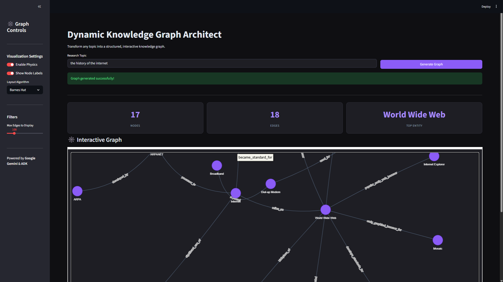
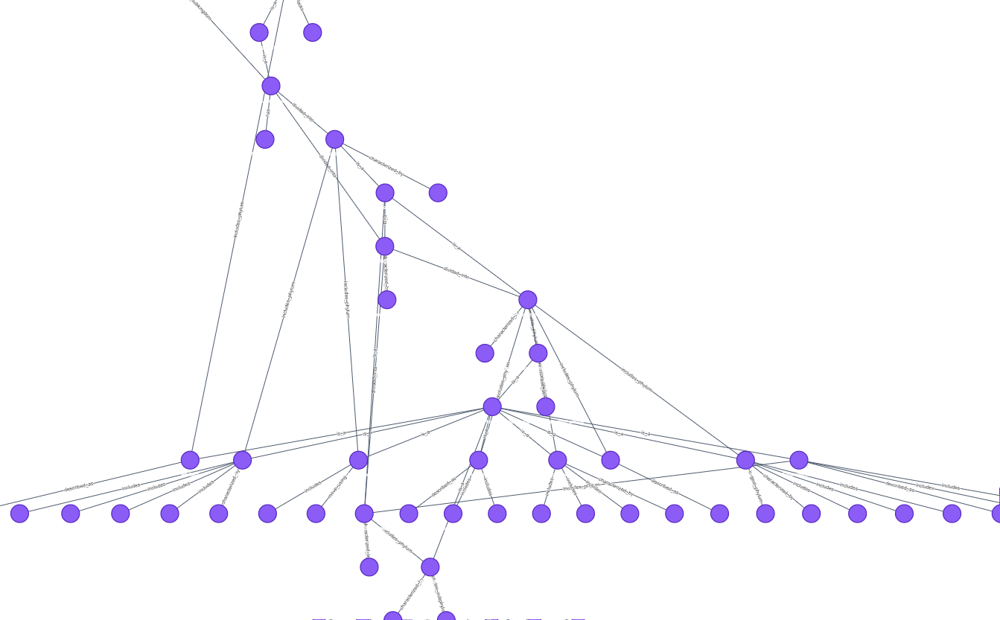

# Dynamic Knowledge Graph Architect  
## Transforming Unstructured Thought into Structured Visual Maps  
**Track**: Freestyle Track

### Problem Statement
In the era of Large Language Models, we have access to infinite information, but "understanding" often requires structure. Reading a 5-page summary of a complex ecosystem, a novel's plot, or a corporate hierarchy is inefficient. Humans understand complex systems best through **visual maps**, not linear text. Existing tools either require manual diagramming or are limited to pre-defined schemas.

The problem is that while LLMs are great at generating text, they lack the native ability to "see" and "draw" the connections they understand. We need a bridge between the unstructured reasoning of an LLM and the structured, visual nature of a graph.

### Why agents?
Agents are the perfect solution for this problem because it requires a **multi-step cognitive pipeline** that no single prompt can achieve reliably:
1.  **Research**: An agent needs to act as a librarian, gathering broad context without getting bogged down in details.
2.  **Ontology Extraction**: A separate cognitive step is needed to enforce structure (Subject -> Predicate -> Object) on that research.
3.  **Code Execution**: Finally, an agent needs to act as a developer to write the visualization code.

A single LLM call often hallucinates graph structures or fails to generate valid visualization code. By breaking this into specialized agents—a Researcher, a Structurer, and a Visualizer—we achieve higher accuracy, better error handling, and a system that can "think" before it "draws."

### What you created
I created the **Dynamic Knowledge Graph Architect**, a sequential multi-agent system powered by the **Google Agent Development Kit (ADK)**.

**Architecture:**
The system is a pipeline of three specialized agents:
1.  **ResearchAgent**: Uses Gemini 2.5 Flash Lite to synthesize a comprehensive summary of the user's topic.
2.  **OntologyAgent**: Analyzes the summary and extracts structured triplets using a custom `add_triplet` tool, building a graph state in memory.
3.  **VisualizationAgent**: Reads the graph state and writes Python code (using `networkx` and `matplotlib`) to generate static assets, while the frontend uses `PyVis` for interactive exploration.

The backend is a **FastAPI** server that orchestrates these agents, and the frontend is a **Streamlit** application that provides a polished, interactive user interface.

### Demo
The solution is a fully interactive web application. Users simply enter a topic (e.g., "The History of the Internet"), and the agents build a graph in real-time.

**Interactive UI:**

**Visualization Styles:**
The app supports multiple layouts, including a "Mind Map" mode that forces a hierarchical structure:

### The Build
I built this project using the **Google Agent Development Kit (ADK)** as the core framework.

**Tools & Technologies:**
*   **Google ADK**: For defining agents, tools, and the sequential pipeline.
*   **Gemini 2.5 Flash Lite**: The intelligence behind the agents.
*   **Streamlit**: For the interactive, dark-mode UI.
*   **PyVis & NetworkX**: For graph processing and visualization.
*   **FastAPI**: To serve the agent pipeline as an API.

**Key Implementation Details:**
*   **Custom Tools**: I built a `KnowledgeBase` class with `add_triplet` and `get_graph_state` tools to give the agents "memory" of the graph they are building.
*   **Observability**: I implemented a `GraphBuilderPlugin` to track metrics like "Knowledge Velocity" (triplets added per second).
*   **Micro-Commits**: I used a rigorous git workflow with micro-commits to track every feature and fix.

### If I had more time, this is what I'd do
1.  **Recursive Expansion**: Allow users to click a node in the graph to trigger a new agent run that expands *just that node*, effectively letting you "zoom in" infinitely into the knowledge graph.
2.  **Source Citations**: Modify the ResearchAgent to store URLs for every fact, so clicking a node opens the original source material.
3.  **3D Visualization**: Upgrade the frontend to use a 3D graph library for an even more immersive experience.